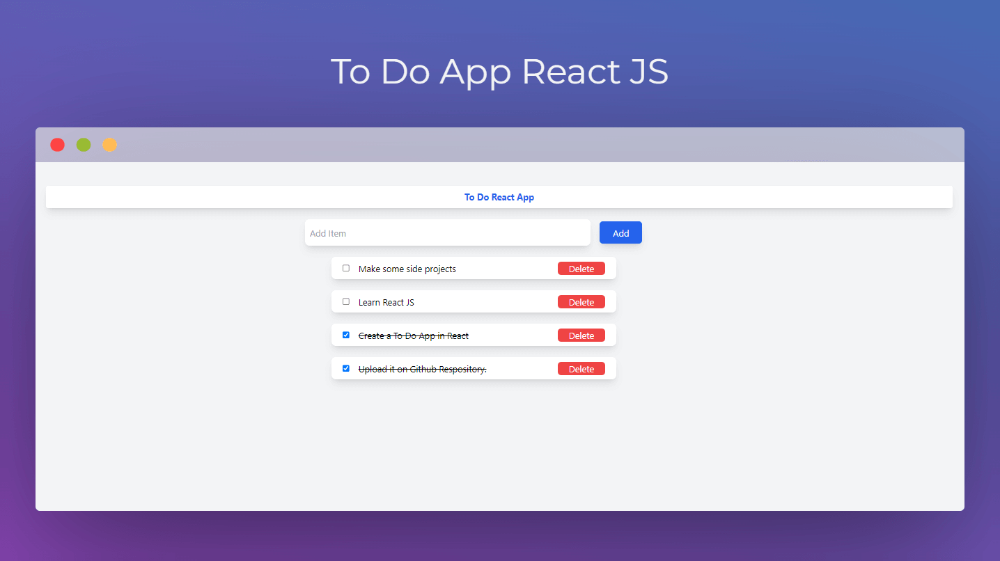

# To-Do React JS App



## Overview

This is a simple To-Do app built with React JS. It allows you to manage your tasks by adding, marking as completed, undoing completion, and deleting items from the to-do list.

## Features

### 1. Add an item to the to-do list

Easily add new tasks to your to-do list. Simply enter the task in the input field and press the "Add" button. The new task will be added to the list.

### 2. Mark the item as completed and undo completion

Keep track of completed tasks by marking them as done. Click on a task to mark it as completed. If you accidentally mark a task as done, you can undo the completion by clicking on it again.

### 3. Delete items from the to-do list

Remove tasks that you no longer need by clicking on the delete button next to the task. This helps you keep your to-do list organized and clutter-free.

## Installation

To run the To-Do React JS App locally, follow these steps:

1. Clone this repository to your local machine:

```bash
git clone https://github.com/amitm13/React-js-todo-app.git
```

2. Navigate to the project directory:

```bash
cd todo-react-app
```

3. Install the dependencies:

```bash
npm install
```

4. Start the development server:

```bash
npm start
```

5. Open your browser and visit [http://localhost:3000](http://localhost:3000) to use the To-Do React JS App.

## Contributing

If you would like to contribute to this project, feel free to fork the repository and submit a pull request. We welcome contributions from the community!

## License

This To-Do React JS App is open-source and available under the [MIT License](LICENSE). Feel free to use, modify, and distribute it as per the terms of the license.